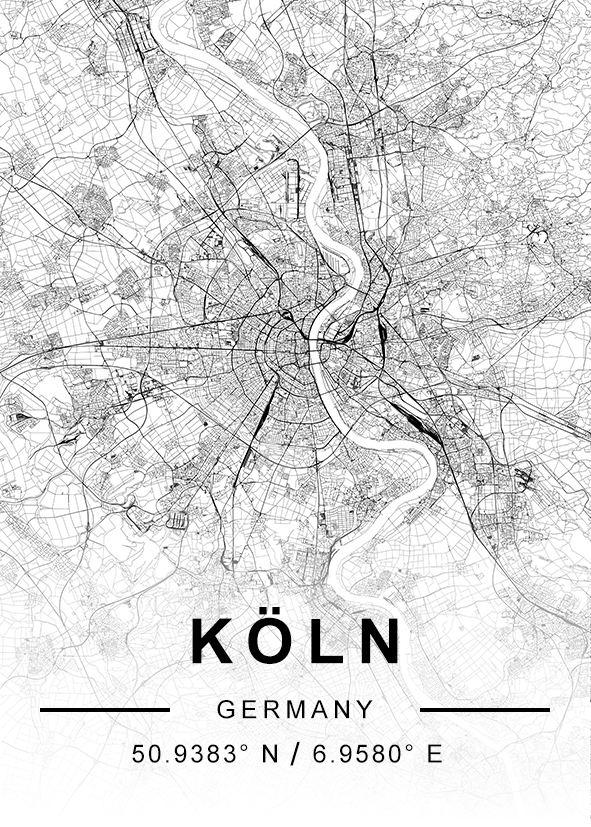

# City Maps

Inspiration is drawn from [this](https://www.etsy.com/listing/581219656/custom-map-print-custom-map-custom-city).

## Get all access-tokens

For this to work, you need a mapbox token (written into `renderer/token.sh`) and a maptiler token (should replace `{key}` inside of `black_white.json`)

## Usage

1. install [mapbox-map-image-export](https://github.com/digidem/mapbox-map-image-export) globally using npm
   - command `export-map --help` should be working
2. specify your mapbox token in `renderer/token.sh` using syntax:
```bash
export MAPBOX_TOKEN="YOUR-MAPBOX-TOKEN"
```

3. then run `renderer/render.sh` with parameters `run LAT,LONG RADIUS STYLE_JSON [debug]`

  - `LAT` and `LONG` are the center coordinate in decimal degrees using pos./neg. numbers instead of N/E/S/W
  - `RADIUS` are in kilometers
  - `STYLE_JSON` is the relative path to the map style to be used (created using maputnik)
  - `[debug]` optional parameter to open `export-map` in debug mode

4. insert image into `Template.psd`

If you need, you can create your own styles using [Maputnik](https://maputnik.github.io) which can be used online or offline. Store the style as `STYLE_NAME.json`.

Enjoy your final poster, that could look like this:




